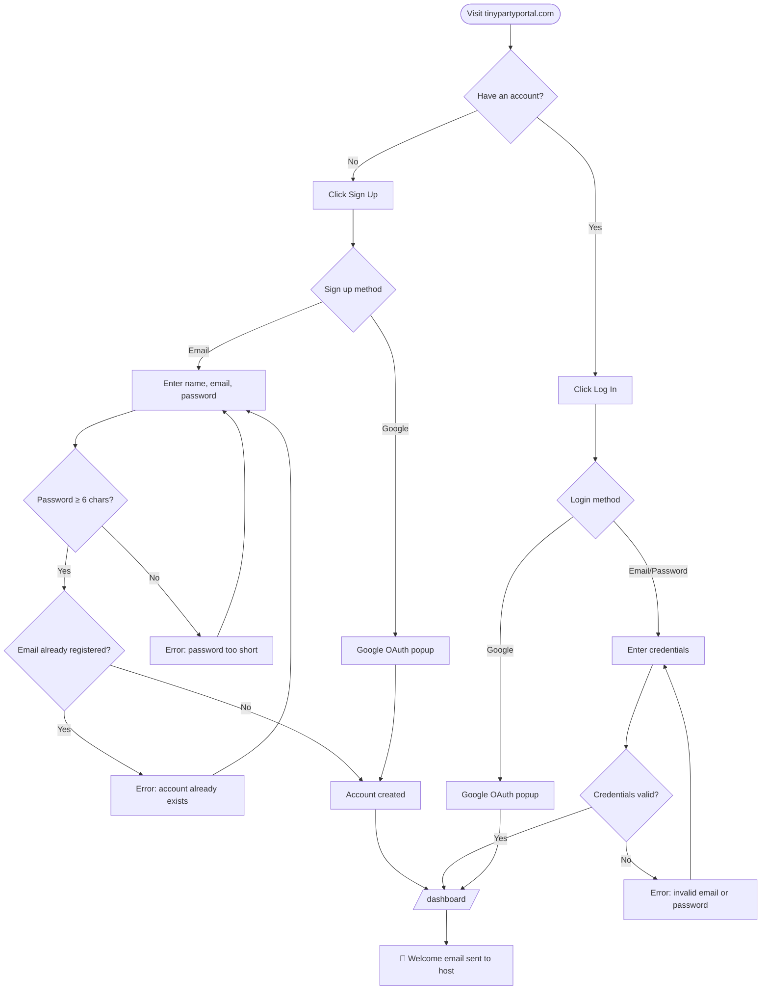
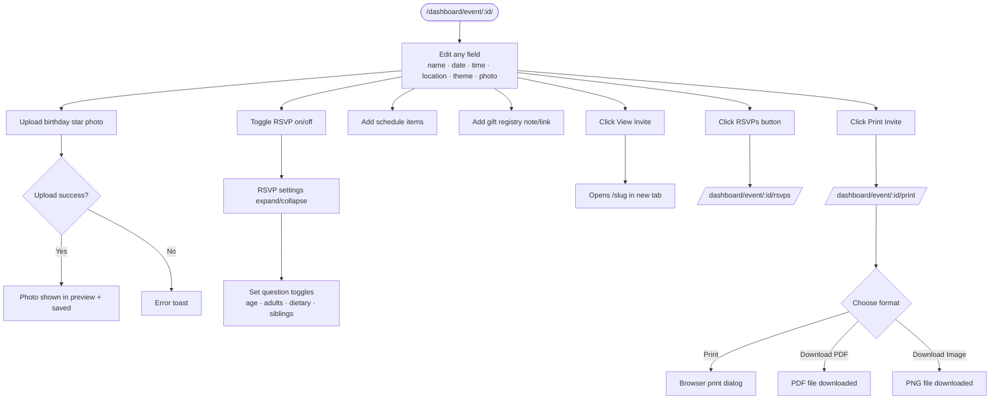
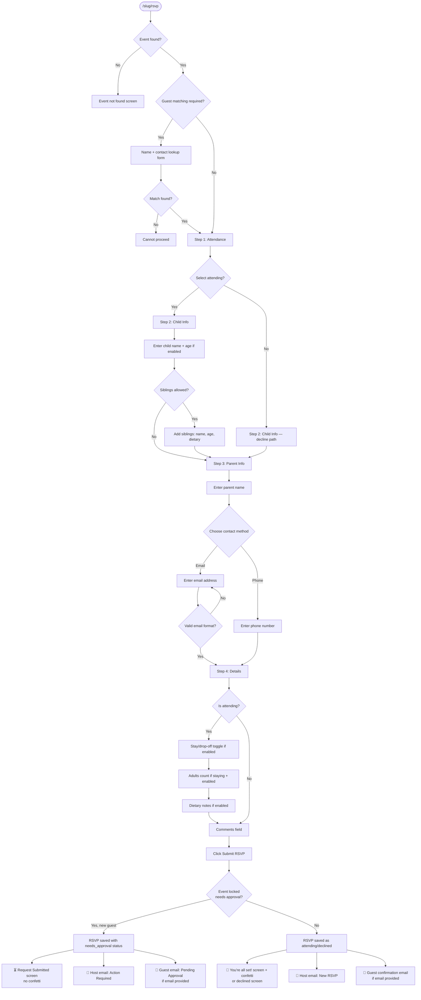
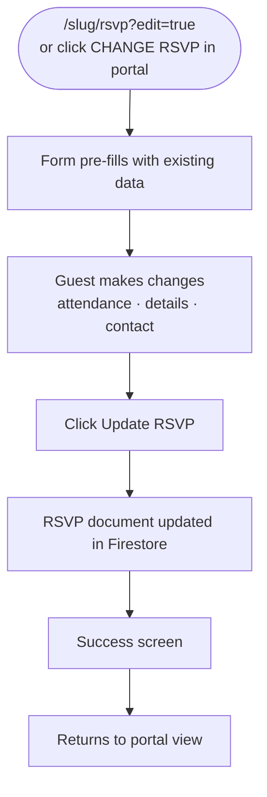
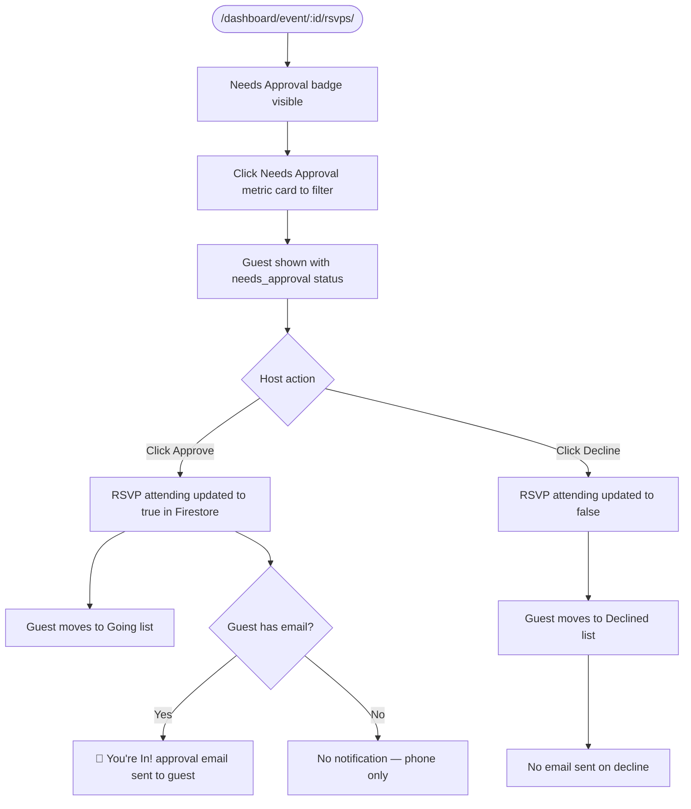
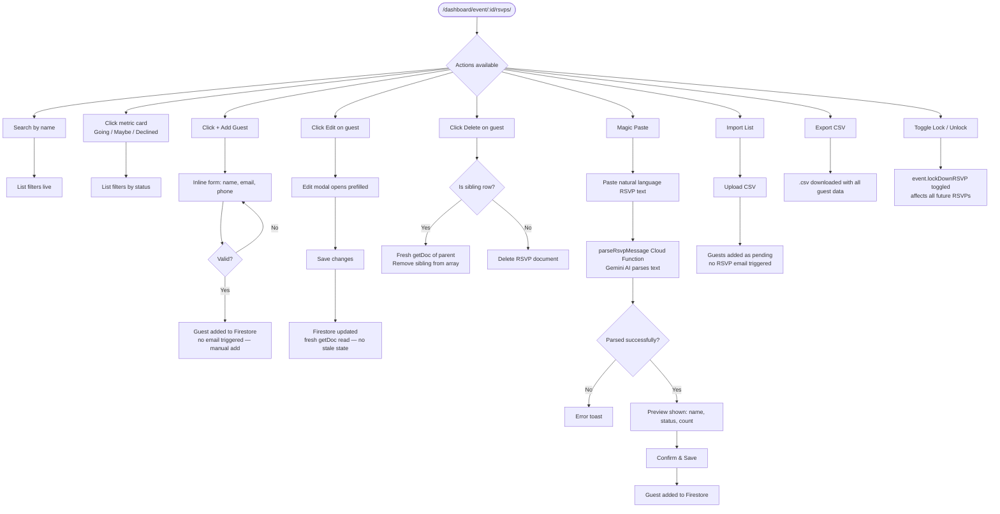
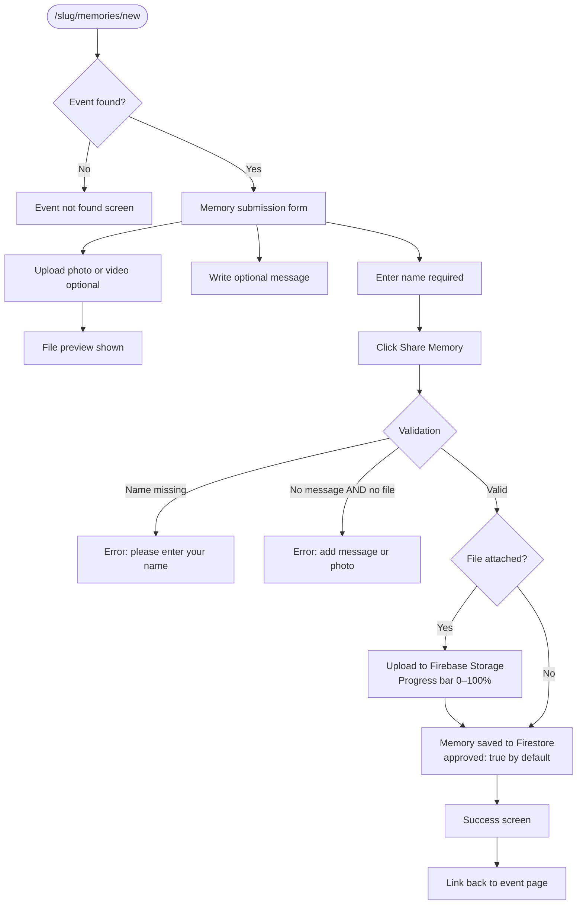
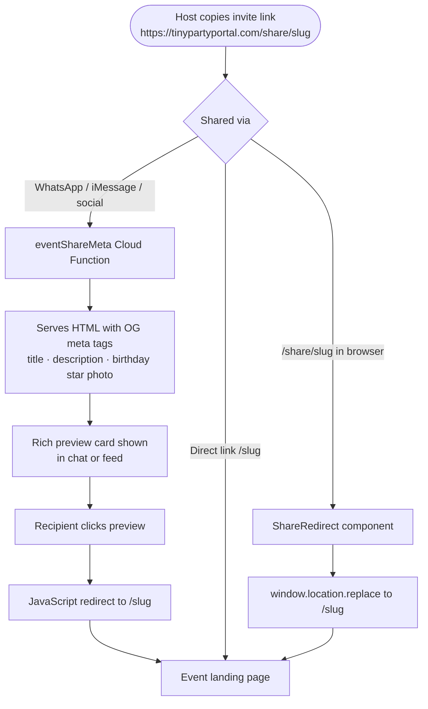

# Tiny Party Portal — User Flow Diagrams

All diagrams use [Mermaid](https://mermaid.js.org/) syntax.
Paste any diagram into [https://mermaid.live](https://mermaid.live) to render it.

---

## 1. Host Signup & Onboarding



---

## 2. Host Creates an Event

```mermaid
flowchart TD
    A([/dashboard/]) --> B[Click + New Party]
    B --> C[/dashboard/create]
    C --> D[Fill in required fields\nchild name · occasion · date]
    D --> E[Choose theme & colour scheme]
    E --> F[Configure RSVP settings\ntoggle on/off · questions · sibling rules]
    F --> G[Click Create Party]
    G --> H{Validation pass?}
    H -- No --> I[Show field errors]
    I --> D
    H -- Yes --> J[Event created in Firestore]
    J --> K[/dashboard/event/:id/]
    J --> L[📧 Host confirmation email sent\nYour Party is Ready!]
    J --> M[📧 Admin notification email sent]
```

---

## 3. Host Manages Event Details



---

## 4. Guest Views Invite & RSVPs

```mermaid
flowchart TD
    A([Guest receives invite link\n/slug or /share/slug]) --> B[/slug — Event Landing Page]
    B --> C{Event found?}
    C -- No --> D[Party not found screen]
    C -- Yes --> E[Themed invitation card shown]

    E --> F{Has guest already RSVPd?}
    F -- Yes, localStorage flag set --> G[Portal view shown\nsee Flow 6]
    F -- No --> H[Invitation view shown]

    H --> I{Guest actions}
    I -- Click RSVP NOW --> J[/slug/rsvp — RSVP Form\nsee Flow 5]
    I -- Add to Cal → Google --> K[Google Calendar opens prefilled]
    I -- Add to Cal → Apple/Outlook --> L[.ics file downloaded]
    I -- Click address --> M[Google Maps opens]
    I -- Already RSVPd? toggle --> N[Lookup form shown]

    N --> O[Enter name + contact]
    O --> P{Match found in Firestore?}
    P -- Yes --> G
    P -- No --> Q[Not found message]
    Q --> R[Contact Organiser form shown]
    R --> S[Enter name, contact, message]
    S --> T{Form valid?}
    T -- No --> S
    T -- Yes --> U[contactOrganiser Cloud Function called]
    U --> V[📧 Host receives guest message email]
    V --> W[Success message shown to guest]
```

---

## 5. Guest RSVP Form — Full Flow



---

## 5A. Guest Edits Existing RSVP



---

## 6. Event Portal — Post-RSVP Guest View

```mermaid
flowchart TD
    A([Landing page after RSVP\nor lookup match]) --> B[Portal view shown]
    B --> C[Status banner: YOU'RE GOING / NOT ATTENDING]

    B --> D{Is attending?}
    D -- Yes --> E[Show schedule if set]
    D -- Yes --> F[Show gift registry\nif host has set one]
    D -- Yes --> G[Show location, parking, maps link]
    D -- Yes --> H[Show countdown timer to event date]

    B --> I[Add to Calendar button\nGoogle / Apple / Outlook]
    B --> J[Contact host\nEmail or SMS based on host contact type]
    B --> K[Click CHANGE RSVP]
    K --> L[/slug/rsvp?edit=true]
```

---

## 7. Host Approves / Declines Guests (Lock Mode)



---

## 8. Host Manages Guest List



---

## 9. Guest Submits a Memory



---

## 10. Host Manages Memories

```mermaid
flowchart TD
    A([/dashboard — Memories tab]) --> B[Masonry grid of all memories]
    B --> C[Stats: Total · Approved · Pending]

    B --> D{Per memory actions}
    D -- Click Approve toggle --> E{Currently approved?}
    E -- Yes → unapprove --> F[approved set to false\nHidden from live display]
    E -- No → approve --> G[approved set to true\nVisible in live display]

    D -- Click Delete --> H[Memory deleted from Firestore\nFile removed from Storage]

    B --> I[Live Display link]
    I --> J[/slug/live — Slideshow screen]
    J --> K[Only approved memories shown]
    K --> L[Auto-advances every 7 seconds]
    L --> M{New memory approved?}
    M -- Yes --> N[Slideshow updates in real time\nno page refresh needed]
```

---

## 11. Email Notification Map

```mermaid
flowchart LR
    subgraph Triggers
        T1[New user signup]
        T2[New event created]
        T3[New RSVP submitted]
        T4[RSVP approved by host]
        T5[Guest contacts organiser]
        T6[Contact page form submitted]
    end

    subgraph Recipients
        R1[New host]
        R2[Event host]
        R3[Guest]
        R4[Admin\nclb.bertram@gmail.com]
        R5[Support team\ninfo@ + codebertcreations@]
    end

    T1 -->|Welcome email| R1
    T1 -->|New signup notification| R4

    T2 -->|Your Party is Ready!| R2
    T2 -->|New event notification| R4

    T3 -->|New RSVP / Action Required| R2
    T3 -->|RSVP Confirmed / Pending Approval\nonly if guest provided email| R3

    T4 -->|You're confirmed!\nonly if guest provided email| R3

    T5 -->|Guest message email\nreply-to set to guest email if they used one| R2

    T6 -->|Contact form submission| R5
```

---

## 12. Share Link & OG Preview


